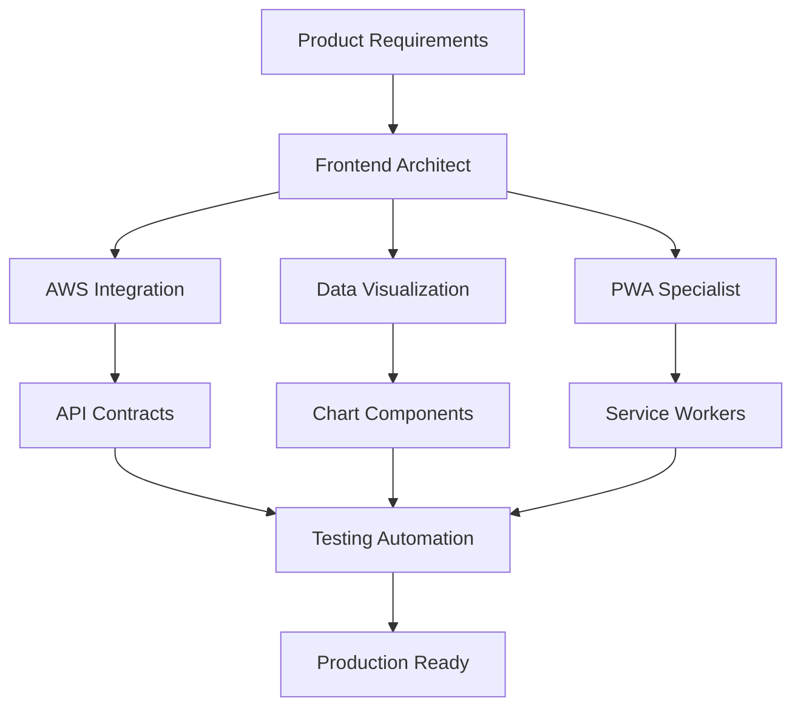

# Central Analytics Dashboard - Claude Code Agents

## Overview
This directory contains specialized Claude Code agents designed to collaboratively build the Central Analytics Dashboard PWA. Each agent has specific expertise and responsibilities, working together to deliver a production-ready application.

## Agent Team

### 🏗️ [Frontend Architect](./frontend-architect.md)
**Specialization**: React/Next.js PWA architecture, component design, state management
**Key Responsibilities**:
- Project setup and structure
- Component library development
- Performance optimization
- Responsive design implementation
- TypeScript architecture

### ☁️ [AWS Integration](./aws-integration.md)
**Specialization**: AWS services, serverless architecture, real-time data pipelines
**Key Responsibilities**:
- CloudWatch metrics integration
- DynamoDB/RDS data storage
- Lambda functions and API Gateway
- WebSocket real-time streaming
- Cost optimization strategies

### 📊 [Data Visualization](./data-visualization.md)
**Specialization**: Interactive charts, real-time dashboards, dark mode optimizations
**Key Responsibilities**:
- Chart component library (Recharts/D3.js)
- Real-time data visualization
- Custom chart types (gauges, heatmaps)
- Export functionality
- Mobile-optimized visualizations

### 📱 [PWA Specialist](./pwa-specialist.md)
**Specialization**: Service workers, offline functionality, cross-platform optimization
**Key Responsibilities**:
- Service worker implementation
- Offline data synchronization
- Push notifications
- Installation flow optimization
- iOS/Android specific features

### ✅ [Testing Automation](./testing-automation.md)
**Specialization**: Automated testing, performance monitoring, CI/CD pipelines
**Key Responsibilities**:
- Unit and integration testing
- E2E test automation
- Performance monitoring
- Accessibility compliance
- Visual regression testing

## How to Use These Agents

### Starting a New Feature
```bash
# 1. Consult the Frontend Architect for component structure
# 2. Work with AWS Integration for backend requirements
# 3. Engage Data Visualization for chart components
# 4. Have PWA Specialist review offline capabilities
# 5. Ensure Testing Automation validates everything
```

### Agent Collaboration Flow



## Quick Start Commands

### Initialize Project with Frontend Architect
```bash
npx create-next-app@latest central-analytics --typescript --tailwind --app
cd central-analytics
npm install next-pwa recharts framer-motion zustand
```

### Setup AWS Infrastructure with AWS Integration
```bash
npm install -g aws-cdk
cdk init app --language typescript
cdk deploy AnalyticsDashboardStack
```

### Run Tests with Testing Automation
```bash
npm run test:unit       # Unit tests
npm run test:integration # Integration tests
npm run test:e2e        # End-to-end tests
npm run test:a11y       # Accessibility tests
npm run lighthouse      # Performance audit
```

## Project Structure

```
central-analytics/
├── agents/                 # Claude Code agent specifications
│   ├── frontend-architect.md
│   ├── aws-integration.md
│   ├── data-visualization.md
│   ├── pwa-specialist.md
│   └── testing-automation.md
├── docs/                   # Project documentation
│   ├── PRODUCT.md         # Functional requirements
│   ├── DESIGN.md          # UI/UX specifications
│   └── PWA-TECHNICAL.md   # PWA implementation guide
├── src/                    # Source code
│   ├── app/               # Next.js app directory
│   ├── components/        # React components
│   ├── lib/              # Utilities and libraries
│   └── styles/           # Global styles
├── public/                # Static assets
│   ├── icons/            # PWA icons
│   ├── screenshots/      # App screenshots
│   └── sw.js            # Service worker
└── tests/                 # Test files
    ├── unit/
    ├── integration/
    └── e2e/
```

## Communication Protocol

### Daily Sync Topics
- **Morning**: Review overnight metrics and alerts
- **Midday**: Feature development progress
- **Evening**: Test results and deployment status

### Code Review Process
1. Frontend Architect reviews component structure
2. AWS Integration validates API contracts
3. Data Visualization checks chart implementations
4. PWA Specialist ensures offline functionality
5. Testing Automation runs full test suite

### Escalation Path
1. **Component Issues** → Frontend Architect
2. **API/Backend Issues** → AWS Integration
3. **Chart/Visualization Issues** → Data Visualization
4. **Offline/PWA Issues** → PWA Specialist
5. **Quality/Testing Issues** → Testing Automation

## Key Technologies

| Category | Technologies |
|----------|-------------|
| **Frontend** | Next.js 14+, React 18, TypeScript 5 |
| **Styling** | Tailwind CSS, Framer Motion, Geist Font |
| **Data Viz** | Recharts, D3.js, Canvas API |
| **PWA** | Service Workers, IndexedDB, Web Push |
| **AWS** | CloudWatch, DynamoDB, Lambda, API Gateway |
| **Testing** | Jest, Playwright, Lighthouse |
| **CI/CD** | GitHub Actions, Docker, AWS CDK |

## Performance Targets

- **Lighthouse Score**: 95+ (all categories)
- **First Contentful Paint**: < 1.5s
- **Time to Interactive**: < 2.5s
- **Bundle Size**: < 500KB
- **Test Coverage**: > 80%
- **Uptime**: 99.9%

## Security Considerations

- End-to-end encryption (TLS 1.3)
- OWASP Top 10 compliance
- Regular dependency updates
- Penetration testing monthly
- SOC 2 Type II ready

## Getting Help

### Documentation Resources
- [Product Specification](../docs/PRODUCT.md)
- [Design Specification](../docs/DESIGN.md)
- [PWA Technical Guide](../docs/PWA-TECHNICAL.md)

### External Resources
- [Next.js Documentation](https://nextjs.org/docs)
- [AWS SDK Documentation](https://docs.aws.amazon.com/sdk-for-javascript/)
- [PWA Best Practices](https://web.dev/progressive-web-apps/)
- [Recharts Documentation](https://recharts.org/)

## Contributing

When working with these agents:
1. Always specify which agent you're consulting
2. Provide clear context about your current task
3. Reference relevant documentation sections
4. Share code examples when asking for help
5. Report any inconsistencies between agents

## License

This project and its agent specifications are proprietary and confidential.

---

**Remember**: These agents work best when used together. Each brings unique expertise that, when combined, creates a robust, scalable, and user-friendly analytics dashboard.